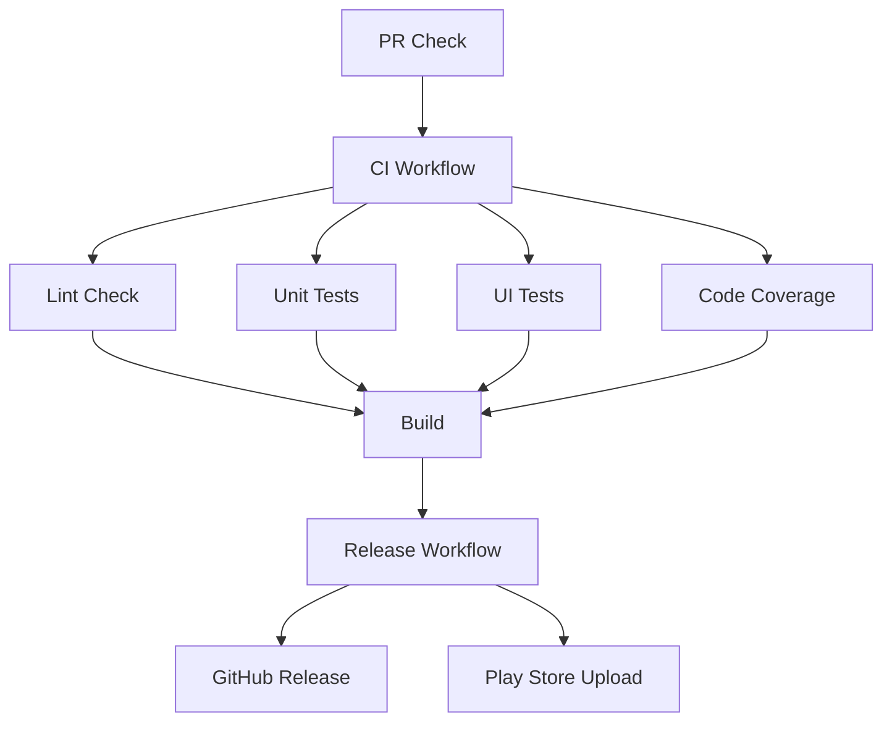

# GitHub Actions Workflows

This directory contains GitHub Actions workflows for the Android Compose base architecture project.

## Workflows Overview

### 1. CI Workflow (`ci.yml`)

**Purpose**: Continuous Integration - runs on every push and PR

**Triggers**:
- Push to `main` or `develop` branches
- Pull requests to `main` or `develop` branches
- Manual workflow dispatch

**Jobs**:
- **Lint Check**: Runs Android lint checks
- **Unit Tests**: Executes all unit tests
- **UI Tests**: Runs instrumented tests on multiple API levels (28, 31, 34)
- **Code Coverage**: Generates JaCoCo coverage reports and uploads to Codecov
- **Build**: Creates debug APK and release AAB

**Quality Gates**:
- All tests must pass
- No lint errors
- Coverage meets thresholds
- Build must succeed

### 2. Release Workflow (`release.yml`)

**Purpose**: Automated release and deployment

**Triggers**:
- Version tags (format: `v*.*.*`)
- Manual workflow dispatch with version input

**Process**:
1. Builds signed release APK and AAB
2. Creates GitHub release with changelog
3. Uploads artifacts to GitHub release
4. Deploys to Google Play Store (Internal Testing track)
5. Sends notifications to Slack

**Environment**: `production` (requires approval)

### 3. PR Check Workflow (`pr-check.yml`)

**Purpose**: Validates pull requests before CI runs

**Triggers**:
- PR opened, synchronized, or reopened

**Validations**:
- PR title follows conventional commit format
- Required test files exist for changed code
- No hardcoded values detected
- Quick lint and test checks

**Output**: Automated PR comments with validation results

## Workflow Dependencies



## Quality Gates

### Coverage Thresholds
- **ViewModels**: ≥ 90%
- **Use Cases**: 100%
- **Repositories**: ≥ 85%
- **Utilities**: 100%

### Test Requirements
- Every Kotlin file must have unit tests
- Every Screen/Component must have UI tests
- All tests must pass
- No skipped or ignored tests

### Code Quality
- No lint errors
- No hardcoded values
- Proper error handling
- Documentation for public APIs

## Required Secrets

Set up in GitHub repository settings:

| Secret | Description | Required |
|--------|-------------|----------|
| `KEYSTORE_FILE` | Base64 encoded keystore | Yes (for releases) |
| `KEYSTORE_PASSWORD` | Keystore password | Yes (for releases) |
| `KEY_ALIAS` | Key alias | Yes (for releases) |
| `KEY_PASSWORD` | Key password | Yes (for releases) |
| `PLAY_STORE_JSON` | Play Store service account JSON | No (for Play Store upload) |
| `CODECOV_TOKEN` | Codecov token | No (for coverage reports) |
| `SLACK_WEBHOOK` | Slack webhook URL | No (for notifications) |

## Branch Protection Rules

Configure in GitHub repository settings:

### Required Status Checks
- `lint` - Lint Check
- `unit-tests` - Unit Tests  
- `ui-tests` - UI Tests
- `coverage` - Code Coverage
- `build` - Build APK

### Additional Rules
- Require PR reviews (at least 1)
- Require branches to be up to date
- Require signed commits (optional)
- Dismiss stale reviews when new commits are pushed

## Local Testing

### Test Workflows Locally
```bash
# Install act (GitHub Actions runner)
brew install act

# Run specific job
act -j unit-tests

# Run entire workflow
act -W .github/workflows/ci.yml

# List available workflows
act -l
```

### Validate Workflow Syntax
```bash
# Install GitHub CLI
brew install gh

# Validate workflow
gh workflow view ci.yml
```

## Troubleshooting

### Common Issues

1. **Tests Failing**
   - Check test logs in Actions tab
   - Run tests locally first: `./gradlew test`
   - Fix flaky tests

2. **Lint Errors**
   - Run lint locally: `./gradlew lint`
   - Fix all lint issues
   - Update lint rules if needed

3. **Coverage Below Threshold**
   - Check coverage report in Actions artifacts
   - Add missing tests
   - Update thresholds if appropriate

4. **Build Failures**
   - Check Gradle logs in Actions
   - Verify dependencies
   - Check signing configuration

5. **Release Failures**
   - Verify all secrets are set
   - Check keystore file format (base64)
   - Verify Play Store service account permissions

### Debug Steps

1. **Check Workflow Logs**
   - Go to Actions tab in GitHub
   - Click on failed workflow run
   - Expand failed job to see logs

2. **Run Locally**
   - Reproduce issue locally
   - Use same Gradle commands as workflow
   - Check environment variables

3. **Validate Configuration**
   - Check workflow YAML syntax
   - Verify secret names match
   - Confirm branch protection rules

## Performance Optimization

### Caching
- Gradle dependencies cached between runs
- Android SDK cached for UI tests
- Build artifacts cached when possible

### Parallel Execution
- Lint, unit tests, and UI tests run in parallel
- Matrix strategy for multiple API levels
- Efficient resource usage

### Build Time
- Use Gradle build cache
- Incremental builds
- Appropriate runner sizes

## Security

### Secret Management
- All sensitive data in GitHub Secrets
- Secrets rotated regularly
- No secrets in repository code
- Environment-specific secrets

### Code Scanning
- Dependency vulnerability scanning
- Static analysis with Detekt
- Security linting rules
- OWASP dependency check

## Monitoring

### Dashboards
- GitHub Actions dashboard
- Codecov coverage dashboard
- Play Console metrics

### Notifications
- Build status notifications
- Release notifications
- Test failure alerts
- Coverage reports

## Contributing

### Adding New Workflows
1. Create new `.yml` file in `.github/workflows/`
2. Follow existing patterns and naming conventions
3. Add documentation to this README
4. Test locally with `act`
5. Submit PR for review

### Modifying Existing Workflows
1. Test changes locally first
2. Update documentation if needed
3. Submit PR with clear description
4. Monitor workflow runs after merge

## Support

For issues with workflows:
1. Check this documentation
2. Review workflow logs
3. Test locally with `act`
4. Create issue with detailed logs
5. Contact maintainers if needed
